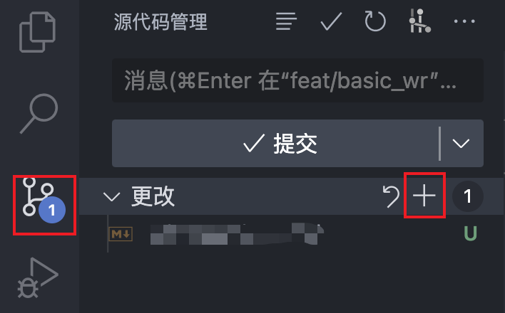
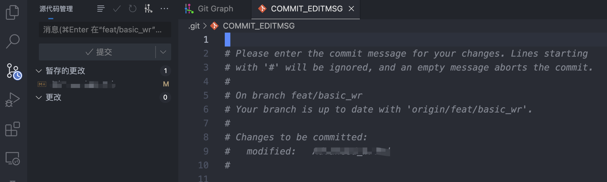
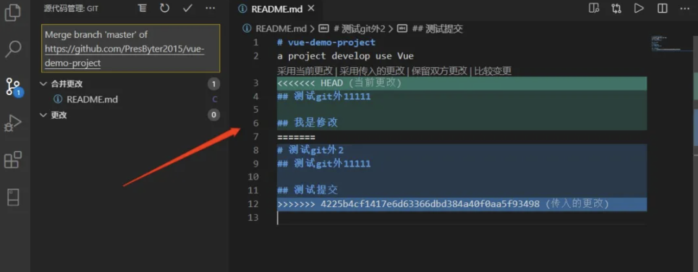

# Advanced

## Basic Git

### gitignore

When you use version control systems like Git to manage your projects, you often encounter situations where you need to ignore certain files or directories. These files may include compiled generated files, temporary files, sensitive information files, and more. To assist you in better project management and ensure that unnecessary files are not added to version control, you can create a file named `.gitignore` that contains rules for the files and directories to be ignored.

1. Generate `.gitignore` file in your git reporsitory

You can use `touch .gitignore` in your terminal or whatever you like.

2. Adding Ignore Rules 

In the `.gitignore` file, you can add rules for files and directories that Git should ignore. The syntax for rules is relatively simple:

- Use `#` to add comments. For example: `# This is a comment`.
- Use the asterisk `*` as a wildcard to match zero or more characters. For example, `*.log` will match all files ending with .log.
- Use `/` to specify directories. For example, `logs/` will match all directories named logs.
- Use `!` to negate a rule. For example, `!important.txt` will unignore the `important.txt` file.

3. Sample `.gitignore`

```bash
# Python template
# Byte-compiled / optimized / DLL files
__pycache__/
*.py[cod]
*$py.class

# C extensions
*.so

# Jupyter Notebook
.ipynb_checkpoints

# Environments
.env
.venv
env/
venv/
ENV/
env.bak/
venv.bak/

### vscode ###
.vscode/*
# !.vscode/settings.json
!.vscode/tasks.json
!.vscode/launch.json
!.vscode/extensions.json
*.code-workspace

### MacOS system file
**/.DS_Store
```

4. Save and push `.gitignore`

```bash
git add .gitignore
git commit -m "Add .gitignore file"
git push
```

5. Test `.gitignore`

```bash
git status
```

## Git usage in VScode

### Push code

1. `git add`



2. `git commit -m`



3. `git push`


### Solving Merge Conflict

1. `git pull origin master`


2. Solve conflict



3. push again

### Live Server

Easy-to-use small HTTP server. (You don’t have to type any command!)

Auto reload when documents are changed.

(Very useful in Manuel's ENGR1000J)

### Snippet

Customize your own snippets!

#### Custom Markdown snippets

```
{
	"tip":{
		"prefix": "tip",
		"body": [
			":::tip",
			"$0",
			":::"
		]
	},
	"warn":{
		"prefix": "warning",
		"body": [
			":::warning",
			"$0",
			":::"
		]
	},
	"theo":{
		"prefix": "theorem",
		"body": [
			":::theorem",
			"$0",
			":::"
		]
	},
	"ce":{
		"prefix": "center",
		"body": [
			":::center",
			"$0",
			":::"
		]
	}
}
```

#### Math Snippets

You may refer to  `hsnips` folder.


## Reference

1. https://zhuanlan.zhihu.com/p/514135557