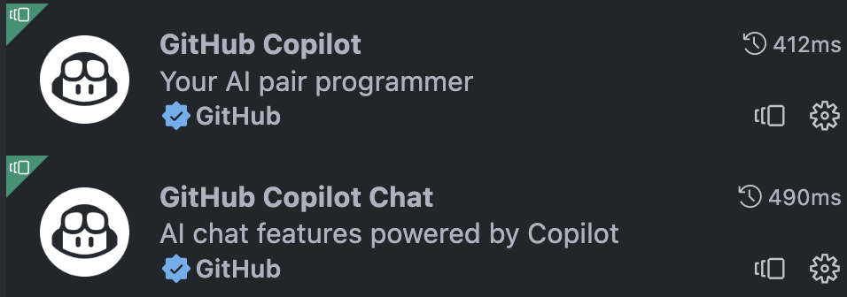
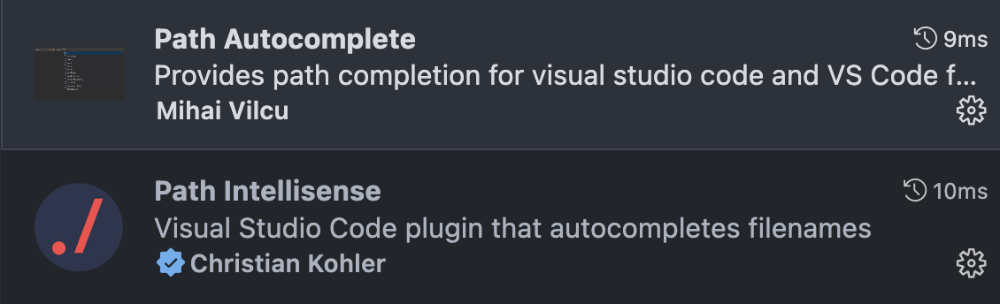

# Basic

Introduction: Basic usage of VS Code; commonly used extensions; C/C++ environment setup.

**Claim: We're not professional VS Code users (no deep research on it), and this workshop would only contain basic usage of VS Code.** Advanced VS Code usage could be learned by reading the official documents or in the workshop which will be held in the future.

## Installation

You can download from the [official website](https://code.visualstudio.com/).

If you are not using the latest version of VS Code, please upgrade it to the latest version!

## Intro

### What is VS Code?

~~Web browser~~ (VS Code was originally written with a *mix of JavaScript and TypeScript*)

Free, cross-platform editor

“Evolved”,modern editor

Features:

- Intellisense
- LSP
- Medium size
- Extension market
- Vim
- …

### [What is the difference between Visual Studio Code and Visual Studio IDE?](https://code.visualstudio.com/docs/supporting/FAQ#_what-is-the-difference-between-visual-studio-code-and-visual-studio-ide)

Visual Studio Code is a streamlined code editor with support for development operations like debugging, task running, and version control. It aims to provide just the tools a developer needs for a quick code-build-debug cycle and leaves more complex workflows to fuller featured IDEs, such as [Visual Studio IDE](https://visualstudio.microsoft.com/).

### Why VS Code?

- Rich language support: support hundreds of languages
- Medium size
- Medium fast
- Highly customizable
- Active extension market
- Good looking
- Native support for HTML/JS/TS
- Powerful native tools

## Themes and Icons

### Common themes:

- One Dark Pro
- Monokai

Find more on https://vscodethemes.com/

### Icons

+ [vscode-icons](https://github.com/vscode-icons/vscode-icons)
+ [Material Theme Icons](https://github.com/material-theme/vsc-material-theme-icons)
+ (macOS user) [vscode-icons-mac](https://github.com/wayou/vscode-icons)

## [JOJ Tools](https://github.com/linsyking/vscode-joj-tools)

Extension: JOJ Tools

*python and pip should be installed.*

*Please first make sure your `joj-submittor` and `ji-auth` is the latest version.*

### Not working?

1. Make sure `pip3` is approachable in your shell

2. ```bash
   pip3 uninstall ji-auth joj-submitter
   ```

   Reload VS Code window.

3. Others: commit an issue on [Github repo](https://github.com/linsyking/vscode-joj-tools)!

## Key Binding

Find original key bindings: `Ctrl + K`  `Ctrl + S`

(If you are using macOS, you may use `cmd+K` `cmd+S` instead.)

Then you can search and change key bindings here.

### Some commonly used:

#### Split windows

Horizontal: `Ctrl+\`

Vertical: `Ctrl+(K+\)`

#### Terminal

Open terminal: `Ctrl+~`

## Useful Extensions

+ Chinese (Simplified) (简体中文) Language Pack for Visual Studio Code


+ GitHub Copilot



+ HyperSnips for Math

You may refer to the [Usage](https://github.com/OrangeX4/hsnips#usage) on official website and files in this repo(`./hsnips`).


+ LaTex Workshop

You may refer to guidence in this [repo](https://github.com/Hydraallen/Latex-vscode).


+ Live server -> very usefull in vg100


+ Path Autocomplete & Path Intellisense



+ wakatime


## Markdown Setup

Extension support for markdowna and basic grammar for markdown.

- Markdown All in One
- Markdown PDF
- Markdown Lint

To enable Auto-Completion, add this to your settings.json

```json
"[markdown]": {
    "editor.quickSuggestions": {
        "comments": "on",
        "strings": "on",
        "other": "on"
    }
},
```

## C/CPP Extension

- C/CPP Extensions
  - C/C++
  - C/C++ Themes
  - C/C++ Extension Pack
- Setting of Extensions
  - Autocomplete
  - Code Folding
  - C/CPP Standard
  - Intelli Sense
  - Inlay Hints
  - (misc) Tab Completion
- Basic Cmakelists

## Debug

- Debug by modifying json file
  - Write manually
  - C/C++: Add Debug Configuration
- Debug Based on the Cmakelists

## Git Extension

- Git Lens
- How to use the built-in git extension

## Format

- Format On Save
- Format Style